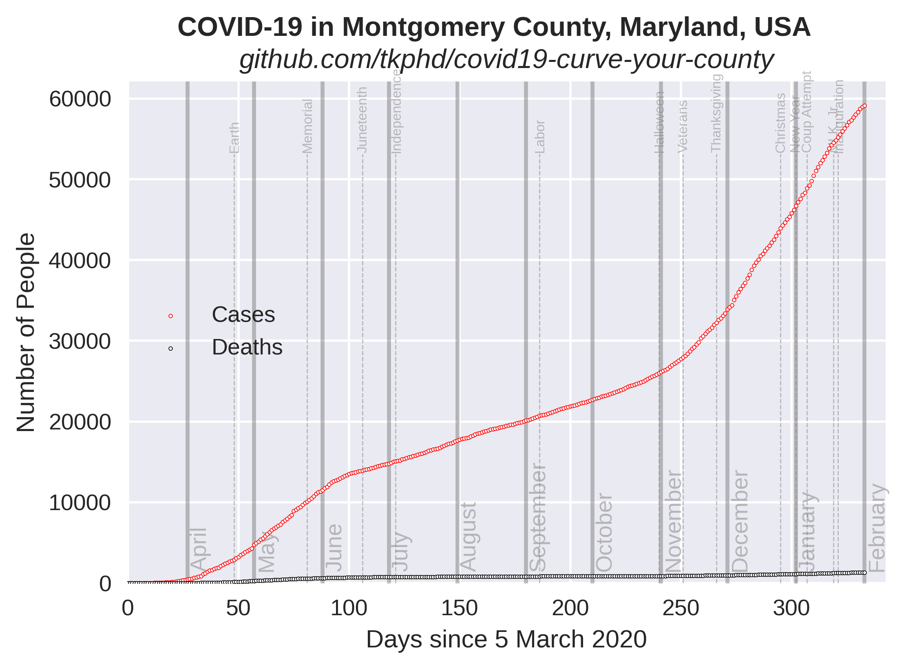

# Extrapolated COVID-19 Infections

Ported from @psteinb's excellent chart for [Dresden, Germany](https://github.com/psteinb/covid19-curve-your-city) 

## Montgomery County, Maryland, USA


*Data source: [Maryland Department of Health](https://coronavirus.maryland.gov/) and [@MontgomeryCoMD](https://twitter.com/MontgomeryCoMD)*

For daily updates, please click through to my [Twitter thread](https://twitter.com/tkphd/status/1247542720517804032).

## About the Model

The figure above is a least-squares fit to the available data. The number of deaths due to COVID-19
and the number of confirmed cases are modeled using a [logistic function](
https://en.wikipedia.org/wiki/Logistic_function) `g(t)`. A simpler model, which was useful early in
the pandemic, is the [exponential growth equation](https://en.wikipedia.org/wiki/Exponential_growth),
`f(t)`. As of mid-April, neither model produces a "good" fit, but the logistic regression is somewhat
better in terms of the residuals.

```math
f(t) = a * (1 + b)^t
g(t) = c / (1 + exp((b - t) / a))
```

where *t* is time, in days since the first reported cases. The fitting parameters are *a*, *b*, and
*c*. For the exponential, *a* is the initial number of cases and *b* is the growth rate. For the
logistic, *a* is the reciprocal of the growth rate (steepness), *b* is the time-coordinate of the
inflection point, and *c* is the size of the population.

The fitting process used in this analysis gives a covariance matrix for the model parameters. From
the covariance matrix, it's possible to compute the one-standard-deviation (sigma) bounds on the
parameters, assuming that the uncertainty on the number of COVID-19 cases for each day is the same.
The gray bands are the plus-one-sigma (upper) and minus-one-sigma (lower) deviations from the
least-squares fit.

## Reproduce This!

1. Install [Python 3](https://www.anaconda.com/distribution/)
2. Install dependencies

   ```bash
   $ conda install matplotlib numpy pandas scipy
   ```

3. Run the `exponential.py` script against the included dataset

   ``` 
   $ python exponential.py
   ```

4. Create your own dataset and compare your location, *e.g.*,

   ```csv
   date,killed,diagnosed,source
   2020-03-05,0,3,"https://www.montgomerycountymd.gov/HHS/RightNav/Coronavirus.html"
   2020-03-08,0,4,"https://www2.montgomerycountymd.gov/mcgportalapps/Press_Detail.aspx?Item_ID=23951"
   ```

   Gaps in the data are OK: just provide what you have. You will want to edit the script to set the
   proper place-name and URL in the title.

5. Share your findings to help others assess the spread of SARS-CoV-2, and to gauge the
   effectiveness of our collective response.

## Statistics

For non-linear curve fitting, the [reduced chi-squared
statistic](https://en.wikipedia.org/wiki/Reduced_chi-squared_statistic) provides an indication of
the goodness-of-fit. It is also instructive to look at the *residual*, or difference between the
real value and its fitted estimate each day,

``` math
res = y - f(t)
```

These parameters are plotted below, with `ν = len(t) - len(p) - 1` degrees of freedom (*p* is the
number of fitting *p*arameters).


## Contact

Please DM me on [Twitter](https://twitter.com/tkphd).
